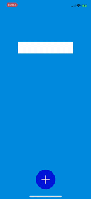
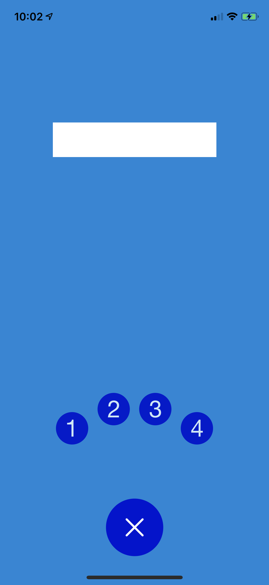
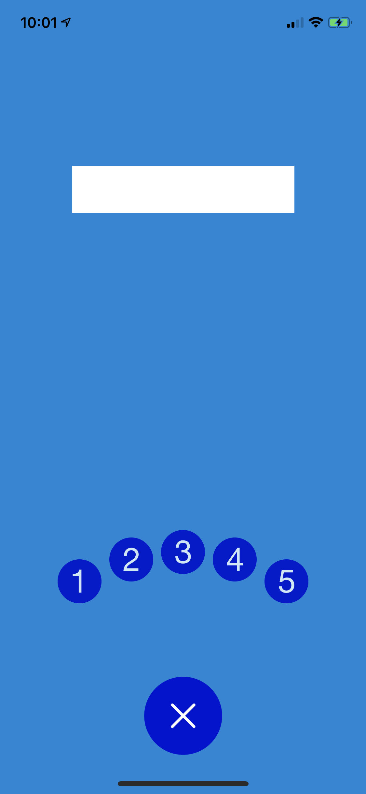
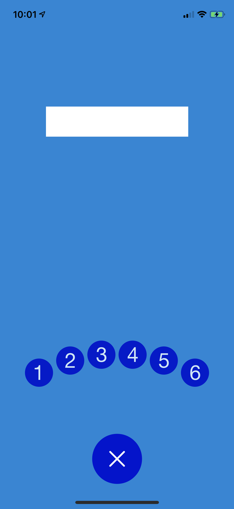
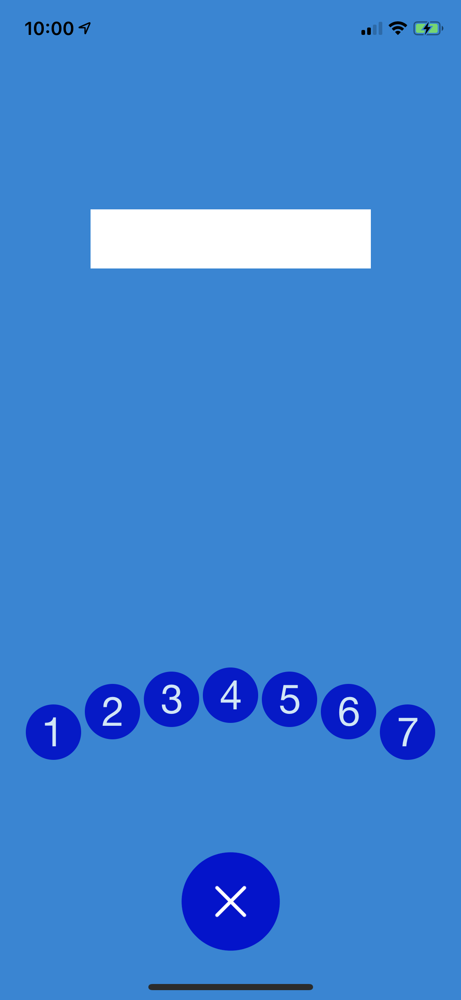

# SuperButton

[](https://travis-ci.org/kraigwastlund/SuperButton)
[](https://cocoapods.org/pods/SuperButton)
[](https://cocoapods.org/pods/SuperButton)
[](https://cocoapods.org/pods/SuperButton)

## Example

```
import SuperButton

class ViewController: UIViewController {

var superButtonView: SuperButtonView!

@IBOutlet weak var actionLabel: UILabel!

override func viewDidLoad() {
super.viewDidLoad()
let mainButtonColor = UIColor(red: 0/255, green: 21/255, blue: 211/255, alpha: 1.0)
superButtonView = SuperButtonView(nodes: nodes(), mainButtonColor: mainButtonColor)
setup()
}

private func setup() {
assert(superButtonView != nil)
self.superButtonView.translatesAutoresizingMaskIntoConstraints = false
self.view.addSubview(self.superButtonView)
let views = [ "super": self.superButtonView! ]
self.view.addConstraints(NSLayoutConstraint.constraints(withVisualFormat: "H:|[super]|", options: NSLayoutConstraint.FormatOptions(rawValue: 0), metrics: nil, views: views))
self.view.addConstraints(NSLayoutConstraint.constraints(withVisualFormat: "V:[super(300)]|", options: NSLayoutConstraint.FormatOptions(rawValue: 0), metrics: nil, views: views))
}

private func fadeDisplayText(text: String) {
actionLabel.alpha = 0.0
actionLabel.text = text
UIView.animate(withDuration: 0.25, animations: { [weak self] in
self?.actionLabel.alpha = 1.0
}) { (complete) in
DispatchQueue.main.asyncAfter(deadline: .now() + 0.5, execute: {
UIView.animate(withDuration: 0.25, animations: { [weak self] in
self?.actionLabel.alpha = 0.0
}, completion: { (complete) in
// do nothing
})
})
}
}

private func nodes() -> [SuperNodeView] {
var nodes = [SuperNodeView]()

// you can instantiate a node this way:
nodes.append(SuperNodeView(title: "Node 1", image: #imageLiteral(resourceName: "1"), completion: { [weak self] in self?.fadeDisplayText(text: "Node 1 Triggered") }))

// or like this:
let node2 = SuperNodeView()
node2.title = "Node 2"
node2.image = #imageLiteral(resourceName: "2")
node2.completion = { [weak self] in self?.fadeDisplayText(text: "Node 2 Triggered") }
nodes.append(node2)

let node3 = SuperNodeView()
node3.title = "Node 3"
node3.image = #imageLiteral(resourceName: "3")
node3.completion = { [weak self] in self?.fadeDisplayText(text: "Node 3 Triggered") }
nodes.append(node3)

let node4 = SuperNodeView()
node4.title = "Node 4"
node4.image = #imageLiteral(resourceName: "4")
node4.completion = { [weak self] in self?.fadeDisplayText(text: "Node 4 Triggered") }
nodes.append(node4)

let node5 = SuperNodeView()
node5.title = "Node 5"
node5.image = #imageLiteral(resourceName: "5")
node5.completion = { [weak self] in self?.fadeDisplayText(text: "Node 5 Triggered") }
nodes.append(node5)

let node6 = SuperNodeView()
node6.title = "Node 6"
node6.image = #imageLiteral(resourceName: "6")
node6.completion = { [weak self] in self?.fadeDisplayText(text: "Node 6 Triggered") }
nodes.append(node6)

let node7 = SuperNodeView()
node7.title = "Node 7"
node7.image = #imageLiteral(resourceName: "7")
node7.completion = { [weak self] in self?.fadeDisplayText(text: "Node 7 Triggered") }
nodes.append(node7)

return nodes
}
}
```


Motion
:-------------------------:|
  |


Three Buttons | Four Buttons | Five Buttons | Six Buttons | Seven Buttons
:-------------------------:|:-------------------------:|:-------------------------:|:-------------------------:|:-------------------------:
  |    |    |    |   

To run the example project, clone the repo, and run `pod install` from the Example directory first.

## Requirements

## Installation

SuperButton is available through [CocoaPods](https://cocoapods.org). To install
it, simply add the following line to your Podfile:

```ruby
pod 'SuperButton'
```

## Author

kraigwastlund, kraigwastlund@gmail.com

## License

SuperButton is available under the MIT license. See the LICENSE file for more info.
