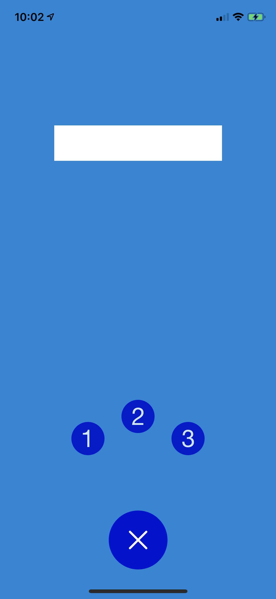

# SuperButton

[](https://travis-ci.org/kraigwastlund/SuperButton)
[](https://cocoapods.org/pods/SuperButton)
[](https://cocoapods.org/pods/SuperButton)
[](https://cocoapods.org/pods/SuperButton)

## Example
.

To run the example project, clone the repo, and run `pod install` from the Example directory first.

## Requirements

## Installation

SuperButton is available through [CocoaPods](https://cocoapods.org). To install
it, simply add the following line to your Podfile:

```ruby
pod 'SuperButton'
```

## Author

kraigwastlund, kraigwastlund@gmail.com

## License

SuperButton is available under the MIT license. See the LICENSE file for more info.
